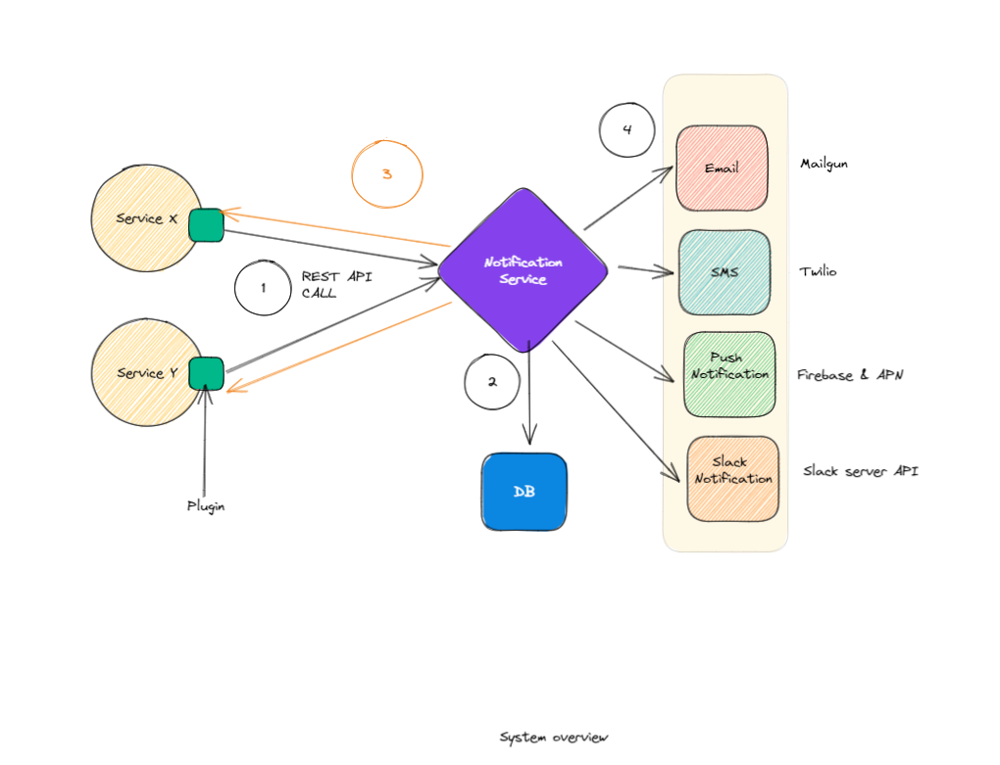
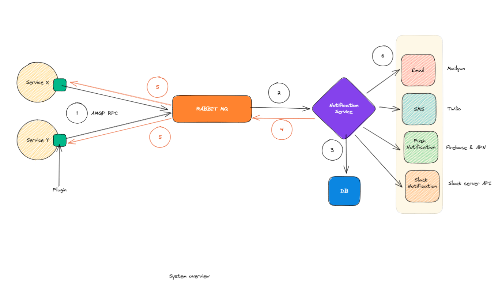

# Breaking News Organization Notification Service

## Table Of Contents
- [Requirements](#requirements)
- [Requirement Breakdown](#requirement-Breakdown)
- [Execution Plan](#execution-plan)
- [Tools](#tools)
- [Notification Plugin Implementation and usage](#notification-plugin-implementation-and-usage)
- [Notification Service Implementation](#notification-service-implementation)
- [How to run the test project](#how-to-run-the-test-project)

## Requirements
- Develop a notifications service (Email and Push notifications), the service must be extensible with support for future notification providers such as SMS notifications, Slack Notifications, and others.
- **The plugin shall be developed as a C# class library** and you can use Pseudo code for SMTP, SMS API, etc.. just make sure that the code is clear, and we can understand the flow you have in mind
- Keep in mind that t**his service will be used as a plugin** by other developers in your organization, on multiple and varied projects, try your best to make it extensible, compatible, and developer friendly.
- **The targeting (input) data should be passed as parameters, and the function shall return a single list of Notification Object’s that contains a GUID as the notification Id and have been created per the request.**
- **Clean code and design patterns will heavily influence the submission’s rating, we suggest using the Decorator pattern,** but feel free to impress us if you have a better approach.
- The system shall implement a non-blocking logic path and might have an isolated database (up to you), but an important thing to note is that **the class library doesn’t have any access to application database and shall be designed as an external library.**

## Requirement Breakdown
- The system will send SMS, Email and Push Notification at the moment
- Notifications will be triggered by different services from varying domains, How and when the plugin is used to call the notification service is up to the calling service
- No requirements regarding scalability have been given, so assuming scalability of that service is out of scope for this task
- The notification service will return the client (caller) service a id of the notification created inside notification service, that maybe be used to track the status of that notification
    - This introduces 2 more things
        - First, plugin needs to communicate with the service using synchronous communication protocol because it wants a response, assuming over HTTP
        - Since we are returning a id to track notification, we may also need to implement an endpoint that lets the client service query for the status of that notification
- The service will use a database of its own to store the notifications
- Assuming the calling services already have the required contact information such as Email, Phone number, Device Id etc and will be able to provide them when calling the plugin.
- The plugin abstracts away the communication protocol with the notification service, So this is our systems overall design so far,
  
- There is a requirement for non-blocking system: Although it’s not clear what is meant by non-blocking here, It could mean 2 things
    - using async await in code
    - or asynchronous communication using message queues.
- If this indicates the later instead of using REST API based communication we will have to use message queues such as Apache Kafka or RabbitMQ.
- If we go with really implementing non-blocking communication between plugin and service using message queue this kind of contradicts a previous requirement to return a response with created notification id, one way to achieve both of them is to use AMQP RPC instead of REST, but AMQP RPC is not really asynchronous/ non-blocking communication like message queueing. Or, since we provide the plugin, we can generate a notification id on the plugin and send it as a request to our notification service, notification service will store this id when saving the notification entity to database and use this when the consumer queries for notification status, notification plugin can return that generated id to caller, but there is no guarantee that this notification was actually created.
- So with that in mind, We will go with AMQP RPC and use RabbitMQ for this. this is how our system will look like:
    

## Execution Plan
- For the notification service: We will build a .NET 6 based web Application that communicates with different notification endpoints, The service will abstract away all the implementation details for communication, and define its own API interface and models. The service will use its own isolated database to store notification and update their state once dispatched. The notifications will not be dispatched immediately, rather upon receiving a notification state, the service will store it to database for processing it later.
  - A Cron job will dispatch notifications and update their state. We will implement the cron jobs using Hangire
- For the plugin: We will build a .NET Class library project that communicates with the service APIs using AMQP RPC call. The plugin will be strongly typed and enforce certain business requirements. In practice this plugin would have been shared as a private NuGet package, but here we will be directly referencing this class library from client service
- For the Demo: We will demonstrate their usage using a news service that uses our developed plugin to communicate with our notification service, with all services hosted on docker using docker compose

## Tools
- .NET 6 and C# for developing both notification service and plugin
- Sql server as the isolated database within Notification Service
- Entity Framework 7 as ORM, ***especially we get to use the new ExecuteUpdate() function introduced with this version***
- RabbitMQ as the MessageQueue sitting between the plugin and the notification Service
- EasyNetQ for easy to use Wrapper over RabbitMQ
- ~~DocFX for generating dynamic documentation from XML Comments and Markdown files~~
- ~~xUnit for unit tests~~
- Serilog for logging, ( we will be using console logs here for demonstration purpose)
- ~~Github CI~~
- Quartz.NET for cron job

## Notification Plugin Implementation and usage
- The plugin is used by adding reference to the class library and using one of its configurations extensions
- ``AddNotificationPluginWithSyncBroker(this IServiceCollection services,
  string? serverUrl)`` For REST API Based communication or
- ```AddNotificationPluginWithAsyncBroker(this IServiceCollection services,string? connectionString)``` For RabbitMQ Based communication
- This injects all supported plugins ( Currently ```EmailPlugin``` and ```PushNotificationPlugin```)
- These Plugins are injected to the DI as scoped and can be used as any other DI injected dependency
- To combine these plugins and use multiple notification plugins to send notifications all together we have also provided a ```AggregateNotificationPlugin```
- To use the ```AggregateNotificationPlugin``` its builder needs to be used, here is an example:
- ```csharp
    // Injected from DI
    EmailPlugin _emailPlugin;
    PushNotificationPlugin _pushNotificationPlugin;
  
    var aggregatePlugin = AggregateNotificationPluginProvider.Create()
                          .WithEmailPlugin(_emailPlugin)
                          .WithPushNotificationPlugin(_pushNotificationPlugin)
                          .Build();
  
    // To send notifications
    await aggregatePlugin.SendNotificationsAsync(notifications)
  ```
-  The other plugins ```EmailPlugin``` and ```PushNotificationPlugin``` can be directly used using Controller or Method injection
   ```csharp
   //Injected from DI
   EmailPlugin emailplugin
   
    await plugin.SendNotificationAsync(notification);
    ```
- To create any new plugin, it must extend the ```INotificationPlugin``` and add new type to NotificationType Enum
- To make the new plugin usable with ```AggregateNotificationPlugin``` we need to add a new function that adds the newly created
  ```csharp
    public IAggregateNotificationPluginBuilder WithSlackNotificationPlugin(SlackNotificationPlugin notificationPlugin)
    {
        if (!_plugins.ContainsKey(NotificationType.SlackNotification))
        {
            _plugins[NotificationType.SlackNotification] = notificationPlugin;
        }

        return this;
    }
  ```
## Notification Service Implementation

- The notification service communicates with plugin using 2 mediums
    1. Using REST API Controllers
    2. Using Message Queue AMQP RPC
- In both cases it validates the request based on the notification type and saves it to database with Pending status then responds with the saved notification guid
- A Quartz.NET based Cron job runs every 3 minutes and dispatches the notification, then updates the entry accordingly
- To support a new kind of notification, A new notification type must be Added to ```NotificationType``` Enum and Add a new function to validate the notification before saving
- Finally a new Broker must be implemented like ```EmailNotificationBroker``` that extends ```INotificationBroker``` and use required library to communicate with the endpoint. Inject that in NotificationService, and finally use that to handle corresponding ```NotificationType``` within the SendNotification function
- ```csharp
    NotificationType.SlackNotification => await _slackNotificationBroker.SendNotification(notification),
  ```

## How to run the test project
- Clone the project from github
- Go to the downloaded location
- Open terminal and type in these commands
- ```cd src```
- ```docker-compose build```
- ```docker-compose up -d```
- After everything completes successfully (should take around 3-5 minutes), you should see 2 applications running on localhost 8000 and 80001 ports
- on Port 8000 is the notification service
- on Port 8001 is a demo service named BreakingNews service
- now if you go to http://localhost:8001/swagger you should see a swagger interactive doc with only 1 API endpoint
- In the request body field, replace contents of the body with this:
  ```
  {
    "headline": "Hello",
    "summary": "World"
  }
  ```
- If everything is working properly you should shortly receive response with 6 GUIDs in a list,
  ```csharp
        [
          "b1172ea0-100e-46a3-846d-08dae7f825fa",
          "277e5e5e-6b17-40f2-846b-08dae7f825fa",
          "68a74afc-78a7-479d-846a-08dae7f825fa",
          "1b324909-1483-4380-8469-08dae7f825fa",
          "fa7fb61a-3f31-4b97-846c-08dae7f825fa",
          "d908b230-7e76-448e-8468-08dae7f825fa"
        ]
  ```  
- These Ids represent notifications that have been created in response to this Breaking News
- To check their status you can go to http://localhost:8000/swagger and use the ```api/notifications``` GET endpoint and paste any of the GUID id there
- You should get the details of the notification with its current status
- Please note, it might take up to 3 minutes for the notification to be dispatched